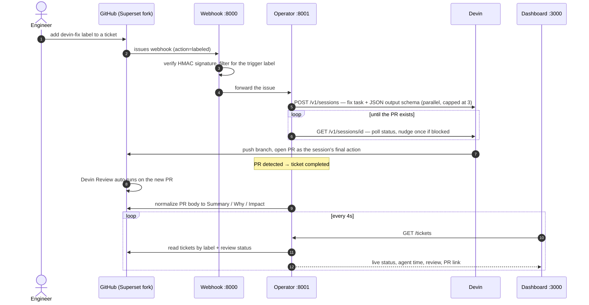

# Devin Demo — Automated Issue Remediation

Label a GitHub issue `devin-fix`. The system spins up a **Devin** session that writes a root-cause fix and opens a PR as its final action, which completes the ticket and triggers an automatic Devin Review. A live dashboard tracks every issue from open to merged.

Target repo is a fork of Apache Superset; the security tickets to remediate carry the `created by Devin` label.

## Quick Start

```bash
cp .env.example .env          # fill in at least DEVIN_API_KEY and GITHUB_TOKEN
docker-compose up --build     # webhook :8000 · operator :8001 · dashboard :3000
open http://localhost:3000
```

**Trigger it** — either add the `devin-fix` label to an issue in the fork (via a GitHub webhook, see below), or drive the pipeline directly without exposing an endpoint:

```bash
curl -X POST http://localhost:8001/issues -H 'Content-Type: application/json' -d '{
  "issue_number": 24,
  "issue_title": "Unsafe YAML deserialization via yaml.Loader in example import",
  "issue_url": "https://github.com/felixbrock/superset/issues/24",
  "repository": "felixbrock/superset"
}'
```

Watch it run on the dashboard.

For real webhook triggering, point **repo → Settings → Webhooks** at `https://<public-url>/webhook` (content type `application/json`, `Issues` event, secret = `GITHUB_WEBHOOK_SECRET`). Use `ngrok http 8000` for a local demo.

## Reset Between Takes

**Keep the stack running** (`docker-compose up`) — reset drives the operator's HTTP API, so run it from a second terminal. Also needs `GITHUB_TOKEN` set.

```bash
./reset.sh          # or: curl -X POST http://localhost:8001/reset
```

Restores a clean slate — terminates running Devin sessions, closes the PRs and deletes their branches, closes each processed issue and recreates a fresh copy (same title/body/labels, minus the trigger label, new number), and clears the local database. Re-add `devin-fix` to run again.

## How It Works

Three containers: **webhook** receives and verifies GitHub events, **operator**
manages Devin sessions and issue state (SQLite), **dashboard** renders live
progress. One labeled ticket flows through the system like this:



Key decisions: the session prompt makes opening the PR the session's **final
action**, so the operator can complete the ticket the moment the PR exists —
no waiting for the session to wind down; a structured output schema lets the
operator read the PR details as JSON instead of parsing prose; failed
sessions retry and blocked sessions get one autonomous-continue nudge (the
pipeline is unattended). Sessions survive operator restarts: on startup the
operator re-attaches to running sessions and polls them to completion, so
state never dangles.

## Observability

The dashboard is the "how do I know it's working" view, keyed off the `created by Devin` label (read live from GitHub, so it survives resets):

- Overview counts — total / in progress / queued / completed / failed — plus a **success-rate** tile (completed / attempted)
- Live cards per running session with a per-second agent-working timer
- Per ticket — status, severity (from the CVSS score in the ticket), live agent working time, a **Review** badge (Devin Review verdict), and a link to the PR
- Failed rows show the failure reason inline
- Full audit trail of state transitions per issue in the operator database

Together these answer the leader's question directly — not just that PRs are being produced, but that each fix ships with an independent review verdict.

## Configuration

| Variable                                  | Required | Description                                        |
| ----------------------------------------- | -------- | -------------------------------------------------- |
| `DEVIN_API_KEY`                           | yes      | Devin v1 key (`apk_*`) for sessions                |
| `GITHUB_TOKEN`                            | yes      | Read issues, normalize PRs, run reset              |
| `GITHUB_WEBHOOK_SECRET`                   | rec.     | HMAC secret for webhook verification               |
| `TARGET_LABEL`                            | no       | Trigger label, default `devin-fix`                 |
| `CATALOG_LABEL`                           | no       | Dashboard ticket label, default `created by Devin` |
| `REPO_OWNER` / `REPO_NAME`                | no       | Target repo, default `felixbrock/superset`         |
| `DEVIN_ORG_ID` / `DEVIN_SERVICE_TOKEN`    | no       | Read Devin Review status (v3 API)                  |
| `MAX_CONCURRENT_SESSIONS` / `MAX_RETRIES` | no       | Throughput and retry limits, default 3 / 2         |

## How This Maps to the Challenge

- **Event-driven** — a GitHub label event triggers the pipeline (webhook or direct POST).
- **Devin as the primitive** — the operator programmatically creates, polls, nudges, and reviews Devin sessions; Devin does the actual remediation.
- **Observable outputs** — PRs with normalized what/why/impact write-ups, Devin Reviews, and a live dashboard with per-ticket review verdicts, success rate, and throughput.

## Development

Run any service outside Docker with `pip install -r requirements.txt && python app.py` (webhook, operator) or `npm install && npm start` (frontend).

## License

MIT
